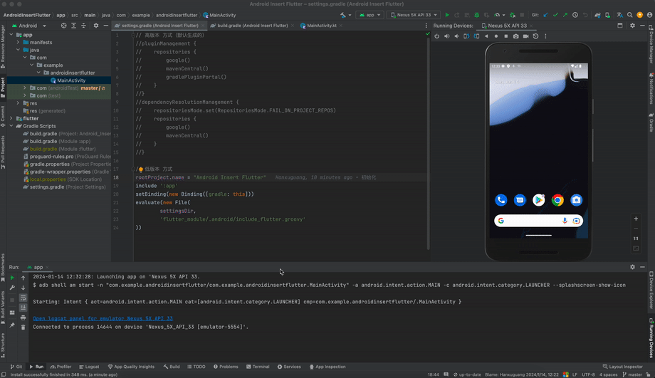

Gradle高版本情况下，Android原生项目引入Flutter模块的简单案例

基础配置版本：
* Flutter版本 ：3.13.2
* Android原生项目Gradle版本：gradle-8.0-bin.zip
* Android Studio 版本：2022.3.1
* Android Studio Gradle 插件版本：8.1.1
* 原生项目由 Android Studio 2022.3.1 创建
  

